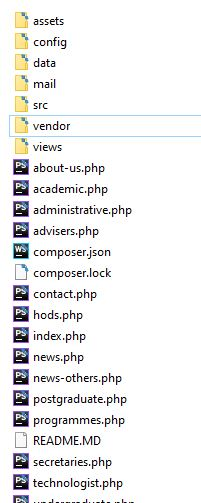

# ABU Simple Department Template (ABUSDTemplate)

## Table of Contents

1. Introduction
2. Folder Structure
3. Running the template Project for Development
4. Anatomy of files


## 1 Introduction

**ABUSDTemplate** is a simple department template project designed by Web Management Unit, Ahmadu Bello University, it is mearnt to help upgrade the old University websites to be more visually appealing. **ABUSDTemplate** is a PHP-based object-oriented flexible and modular web app project that is easily extensible and modifiable.

The template project is a derivative of the popular Model - View - Controller (MVC) web framework but with the Controller absent.

---
Please if you are new to this template, seek help from **Web Management Unit** for onboarding.
---

Note:- When the project is run, you shall be presented with the **department of veterinary physiology** website as a dummy template.

Here department refers to all departments, faculties, institutes, centers and units of Ahmadu Bello University that may require or already have a website.

## 2 Folder Structure

In this folder - the root folder - we have the php files for each page link in our website which I call the simplied page-controller. The page-controller is responsible for fetching the data required by a page, then passing it on to the template file for rendering. Additionally, the root folder has the config, data, mail, src, vendor, views folders and a host of sub-folders.



1. The **config folder** that contain department information and project configurations.
2. The **data folder** contain department data like course listing, staff listing etc.
3. The **mail folder** contain a php script for mail sending.
4. The **src folder** hold the data classes and helper classes.
5. The **vendor folder** contain the project dependency managed by composer, we don't need to change anything here.
6. The **views folder** contain the template files for rendering pages.


## 3 Running the template Project for Development

Using a command prompt, navigate to the project root directory. Then run the command ``` php -S localhost:8000 -t ./public ```. In your browser, open *localhost:8000* and view the websites. You will be presented with the website of department of veterinary physiology which should be edited to suite your department needs.

## 4 Anatomy of files
*TODO*


